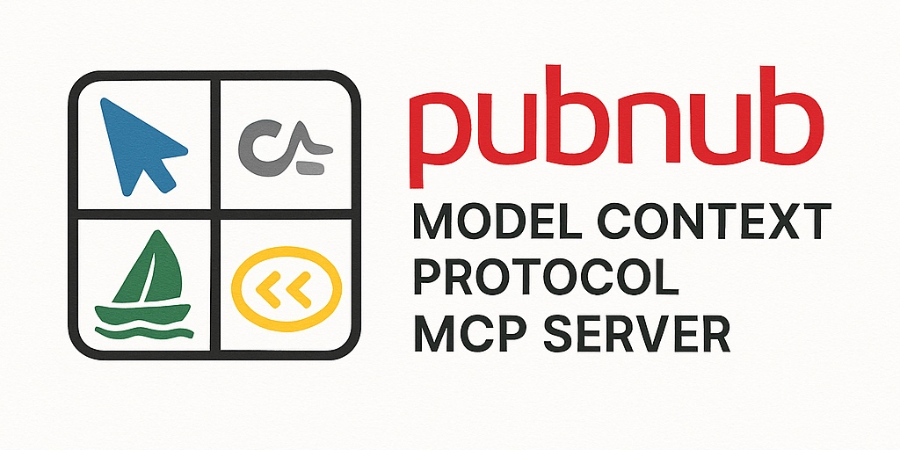
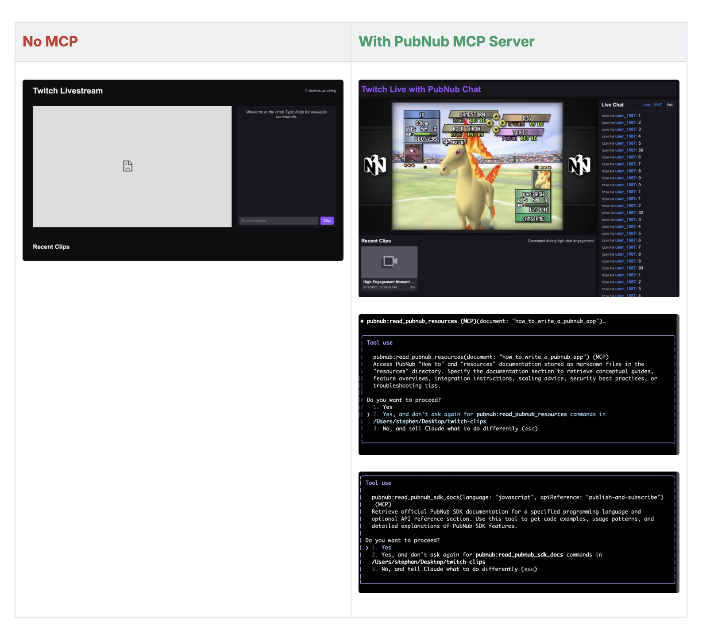

# PubNub Model Context Protocol (MCP) Server for Cursor IDE

[](https://smithery.ai/server/@stephenlb/pubnub-mcp-server)

This repository provides a CLI-based Model Context Protocol (MCP) server that exposes PubNub SDK documentation and PubNub API resources to LLM-powered tools.
This improves the LLM AI Agent's ability to understand and interact with PubNub's SDKs and APIs.



## Example Prompts

- "Write a PubNub app that lets the user watch streaming videos with built-in multi-user chat with PubNub."
- "Write a PubNub app for on-demand delivery of groceries with a map."
- "Write a PubNub app that tracks the location of a package in real-time."
- "Write a PubNub app that shows the weather forecast in real-time."
- "Write a PubNub app that lets users play multiplayer games with friends."
- "Write a PubNub app that shows live stock prices and news updates."
- "Write a PubNub app that lets users create and share playlists with friends."
- "Show me the PubNub JavaScript SDK documentation for `subscribe()`."
- "Build a PubNub JavaScript app that subscribes to the `my_channel` channel and logs messages to the console."
- "Publish a message to the `my_channel` channel with the message `Hello, PubNub!`."
- "Show me the PubNub JavaScript SDK documentation for `subscribe()`."
- "List all available PubNub Functions."
- "Fetch the Python SDK docs for the `publish()` method."
- "Fetch the message history for the `test` channel."
- "Retrieve presence information (occupancy and UUIDs) for the `test` channel and the `default` channel group."

This requires Node.js (>= 18) and npm (https://nodejs.org/).
`npx` will automatically fetch and run the latest MCP server.

## Prerequisites

- Node.js (>= 18) and npm
- Cursor IDE with MCP support
- (Optional) PubNub account and API keys for live examples

## Installation

### Installing via Smithery

To install PubNub MCP Server for Claude Desktop automatically via [Smithery](https://smithery.ai/server/@stephenlb/pubnub-mcp-server):

```bash
npx -y @smithery/cli install @stephenlb/pubnub-mcp-server --client claude
```

### Installing Manually
The preferred way to run the PubNub MCP server locally or add it to Cursor IDE via npx:

```bash
npx -y @pubnub/mcp
```

## Configuration

> *Cursor must be in AGENT MODE to use MCP servers.*

Cursor IDE discovers MCP servers via a JSON config file.
Configure the PubNub MCP server globally or per project.

### Global Configuration

Edit or create `~/.cursor/mcp.json`:

```json
{
  "mcpServers": {
    "pubnub": {
      "command": "npx",
      "args": ["-y", "@pubnub/mcp"],
      "env": {
        "PUBNUB_SUBSCRIBE_KEY": "YOUR_SUBSCRIBE_KEY",
        "PUBNUB_PUBLISH_KEY": "YOUR_PUBLISH_KEY"
      }
    }
  }
}
```

### Project Configuration

In your project directory, create `.cursor/mcp.json`:

```json
{
  "mcpServers": {
    "pubnub": {
      "command": "npx",
      "args": ["-y", "@pubnub/mcp"],
      "env": {
        "PUBNUB_SUBSCRIBE_KEY": "YOUR_SUBSCRIBE_KEY",
        "PUBNUB_PUBLISH_KEY": "YOUR_PUBLISH_KEY"
      }
    }
  }
}
```

- `command` specifies the executable to launch the MCP server.
- `args` specifies the arguments to pass to the command.
- `env` sets environment variables for the server process.

## Using in Cursor IDE

1. Restart Cursor IDE or open a new session.
2. Open the MCP settings pane and verify the **pubnub** server is listed under **Available Tools & Resources**.
3. In chat, invoke available resources:
   - `pubnub://docs/javascript` — Fetch PubNub JavaScript SDK documentation
   - `pubnub://docs/python` — Fetch PubNub Python SDK documentation
   - `pubnub://docs/java` — Fetch PubNub Java SDK documentation
   - `pubnub://functions` — List PubNub Functions (static content from `resources/pubnub_functions.md`)
4. Approve resource execution when prompted, or enable **auto-run** in settings for trusted resources.

## Claude Code

```shell
## Install the MCP server if you have node >= 18
claude mcp add pubnub -e PUBNUB_PUBLISH_KEY=your_publish_key -e PUBNUB_SUBSCRIBE_KEY=your_subscribe_key -- npx -y @pubnub/mcp

## Install the MCP server if you have node < 18 and need to point to the full path of node
claude mcp add pubnub -e PUBNUB_PUBLISH_KEY=your_publish_key -e PUBNUB_SUBSCRIBE_KEY=your_subscribe_key -- /Users/stephen/.nvm/versions/node/v22.14.0/bin/node /Users/stephen/Projects/mcp-pubnub/index.js
```

And the output will be:
```shell
Added stdio MCP server pubnub with command: npx -y @pubnub/mcp to local config
```

### Example prompt
```shell
claude "publish a message 'hi' to the 'my_channel' pubnub channel."
```

```shell
claude "publish a message 'hi' to the 'my_channel' pubnub channel."

╭───────────────────────────────────────────────────╮
│ ✻ Welcome to Claude Code research preview!        │
│                                                   │
│   /help for help, /status for your current setup  │
│                                                   │
│   cwd: /Users/stephen/Projects/mcp-pubnub         │
╰───────────────────────────────────────────────────╯

 ※ Tip: Press Option+Enter to send a multi-line message

> publish a message 'hi' to the 'my_channel' pubnub channel.

⏺ I'll publish a message to the PubNub channel for you.

⏺ pubnub:publish_pubnub_message (MCP)(channel: "my_channel", message: "hi")…
  ⎿  Message published successfully. Timetoken: 17467422499409217

⏺ Message published successfully to "my_channel".
```

Remove the MCP server with:

```shell
claude mcp remove pubnub
```

## Using Claude Desktop

1. In the **Tools** section, add a new tool named **pubnub**.
2. Set the **Command** to `npx` and **Arguments** to `["-y", "@pubnub/mcp"]`.
3. Add environment variables for your PubNub keys:
   - `PUBNUB_SUBSCRIBE_KEY`
   - `PUBNUB_PUBLISH_KEY`
4. Save the configuration.

Claude Desktop may use an old verson of node.
You may need to set the command to the full path of your node installation.

```shell
git clone https://github.com/stephenlb/pubnub-mcp-server.git
```

MCP server is located in the `index.js` file.:

```json
{
  "mcpServers": {
    "pubnub": {
      "command": "/Users/stephen/.nvm/versions/node/v22.14.0/bin/node",
      "args": ["/Users/stephen/Projects/mcp-pubnub/index.js"],
      "env": {
        "PUBNUB_SUBSCRIBE_KEY": "demo",
        "PUBNUB_PUBLISH_KEY": "demo"
      }
    }
  }
}
```

## License

This project is licensed under the MIT License. See the [LICENSE](LICENSE) file for details.

## Troubleshooting

- Must be in agents mode to use MCP servers.
- Verify Node.js and npm installation.
- Ensure `server.js` has execute permission.
- Check that the `command`, `args`, and `env` settings are correct.
- Review Cursor IDE logs for MCP startup errors.

## Direct JSON-RPC Command-Line Usage

You can invoke the MCP server directly over STDIN/STDOUT using JSON-RPC v2.0.
Ensure your PubNub keys are set in the environment, for example:
```bash
PUBNUB_SUBSCRIBE_KEY=YOUR_SUBSCRIBE_KEY \
PUBNUB_PUBLISH_KEY=YOUR_PUBLISH_KEY \
  node index.js
```

Once the server is running (or using a one-off invocation), send requests by piping JSON into `node index.js`. Examples:
```bash
# 1) List available tools
echo '{"jsonrpc":"2.0","id":1,"method":"tools/list","params":{}}' \
  | node index.js

# 2) Read PubNub JavaScript SDK documentation
echo '{"jsonrpc":"2.0","id":2,"method":"tools/call","params":
  {"name":"read_pubnub_sdk_docs","arguments":{"language":"javascript"}}}' \
  | node index.js

# 3) Read PubNub Functions Resource docs (static Markdown)
echo '{"jsonrpc":"2.0","id":3,"method":"tools/call","params":{"name":"read_pubnub_resources","arguments":{"document":"pubnub_functions"}}}' \
  | node index.js

```

## Quick JSON-RPC Examples

Below are simplified JSON-RPC v2.0 command-line examples using STDIN/STDOUT to fetch PubNub SDK documentation and publish messages.

### 1) Fetch PubNub JavaScript SDK documentation
```bash
echo '{"jsonrpc":"2.0","id":2,"method":"tools/call","params":{"name":"read_pubnub_sdk_docs","arguments":{"language":"javascript"}}}' | node index.js
```

### 2) Publish a message to a PubNub channel
```bash
PUBNUB_PUBLISH_KEY=demo \
PUBNUB_SUBSCRIBE_KEY=demo \
echo '{"jsonrpc":"2.0","id":2,"method":"tools/call","params":{"name":"publish_pubnub_message","arguments":{"channel":"my_channel","message":"Hello, PubNub MCP JSON-RPC!"}}}' \
  | node index.js
```

## License

MIT
